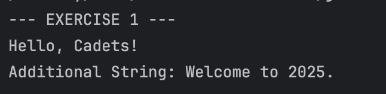
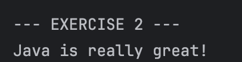
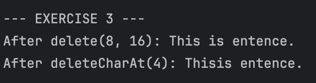
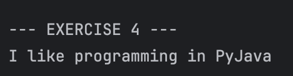
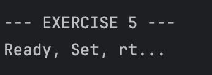
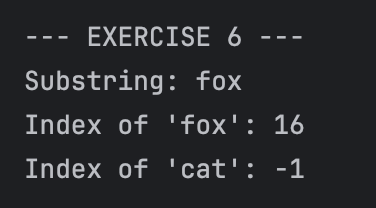
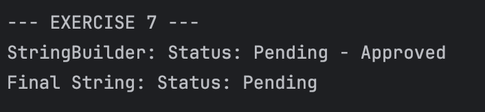

# JC-Exploring-StringBuilders
**Name:** Nuan Patricia Serrano  
**Project Title:** Exploring Java `StringBuilder` 
**Screenshot:**
- Exercise 1: append() - Appending Content  
    
- Exercise 2: insert() - Inserting Content at a Position  
    
- Exercise 3: delete() - Deleting Content  
    
- Exercise 4: replace() - Replacing a Section  
    
- Exercise 5: Method Chaining  
    
- Exercise 6: substring(), indexOf(), and Non-Existing Words  
    
- Exercise 7: toString() - Converting back to a String  
    
